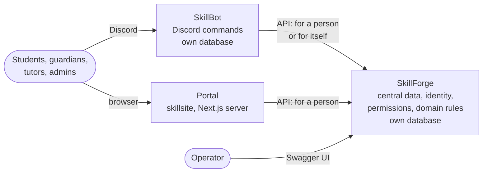

# SkillForge - project sketch

What SkillForge is for, where its borders are, and the principles every change is measured against.
Kept short on purpose, so it can be reread before any larger piece of work. When the intent
changes, it changes here first; ADRs and specs follow.

## In one paragraph

SkillForge is the central service of the skill platform. It keeps the data the whole tutoring
business relies on - who the people are and how they relate: students, guardians, payers, tutors,
companies - and it decides who may do what with that data. Showing that data to people is somebody
else's job. The Discord bot (SkillBot) and the web portal (skillsite) are frontends with their own
backends and, where they need it, their own storage; they come to SkillForge when they need central
data or a decision. **SkillForge is the hub for central data, not the backend of any single
frontend.**

## The platform at a glance



This is the target picture. Parts of today's code still look different - see
[Where we are](#where-we-are).

## What SkillForge owns - and what it does not

| SkillForge owns                                                                                 | The frontends own                                                                                                     |
| ----------------------------------------------------------------------------------------------- | --------------------------------------------------------------------------------------------------------------------- |
| People and organisations, their roles and relations (the CRM)                                   | How things look and feel: pages, commands, messages                                                                   |
| Identities: user accounts, how people log in, links to outside accounts (Discord, sevDesk, ...) | Their sessions and screen state                                                                                       |
| Permissions: which client and which person may do what                                          | Their own picture of the data - for the bot: servers, channels, categories, workspaces, command setups, Discord roles |
| Domain rules and actions that mean something for the business                                   | Rules that only concern their own medium                                                                              |

The test for a rule: **would the other frontend need the same rule?** Then it belongs in SkillForge.
"Only a student's own tutor may act on the student" is a SkillForge rule. "How many archive
categories a Discord server holds" is a bot rule.

## Principles

1. **SkillForge is the hub, not a backend.** Frontends ask SkillForge for central data and
   decisions. They may keep keys and derived or cached data - the bot has to know whose workspace a
   channel is - as long as it can be rebuilt from SkillForge and never flows back. SkillForge keeps
   nothing of theirs.
2. **Every service owns its data,** in its own database where it needs one - the bot on the same
   Postgres server as SkillForge. Central data is reached only through SkillForge's API, never by
   reading another service's tables.
3. **SkillForge pushes nothing.** It does not know who consumes its data. A frontend asks what
   changed since it last looked and brings its own state in line; its handlers are idempotent, so
   asking twice does no harm. Pushing (webhooks) stays an option for the day pulling is too slow.
4. **The CRM is the system of record.** It holds the intended state of the business and knows
   nothing about Discord or logins. Everybody reads it; nobody writes around it
   ([ADR 0007](decisions/0007-crm-system-of-record.md)).
5. **One permission system.** Every endpoint declares once what it requires. There is no second,
   frontend-specific rights system, and what was not deliberately opened stays closed.
6. **Same person, same rights - everywhere.** Whether a tutor acts in the portal or through a
   Discord command, SkillForge decides by the same rules.
7. **The client is the ceiling.** A frontend can never do more for a person than it is allowed to do
   for people at all - and a person can never do more through a frontend than the person may do.
8. **The account is the door.** Only people with a user account use authenticated features. Admins
   create accounts, always for a person who exists in the CRM. Without one, the bot offers a person
   only what needs no identity.
9. **The API is a contract.** `openapi.json` is generated and versioned; the frontends build on it
   ([ADR 0001](decisions/0001-openapi-as-contract.md)).

## How permissions work, in plain words

Three questions decide every request.

1. **Which frontend is asking?** Every frontend is a registered _client_ with its own secret. Its
   _grants_ say what it may do, and each grant has a mode:
   - _for itself_ - work no person asked for, such as routine jobs;
   - _on behalf of people_ - the most it may ever do for any person.
2. **For whom?** A frontend that acts for a person presents a token for that person's account. The
   portal gets one when the person logs in with e-mail and password. The bot gets one by telling
   SkillForge which Discord user sent the command - something only clients explicitly allowed to do
   so may do.

   The two ways are not equally strong. With a password, the person proves who they are; with
   Discord, the bot vouches for them - so the bot's secret speaks for every person linked to
   Discord. That is acceptable for this platform, and it is why a token records how it was
   obtained: changes to an account, such as its e-mail address or password, can then demand a
   password login.
3. **What may that person do?** That follows from the person's _roles_. Student, guardian and tutor
   come from the CRM; admin is assigned to the account. Every person may manage their own account
   and read their own data.

A token carries the overlap of both sides:

```
what the frontend may do for people  ∩  what the person may do
```

A frontend may ask for less - the bot, say, only for what one command needs. It never gets more.

"Their own data" is precise: a person's _reach_ is their own party plus the parties they are parent
of or pay for. Tutors reaching their students follows later, together with rules for what a tutor
may see - who pays for a student, for example, is none of the tutor's business.

## Where we are

As of 2026-09.

| Topic           | Today                                                                                                                                                                 | Target                                                                                                                                   |
| --------------- | --------------------------------------------------------------------------------------------------------------------------------------------------------------------- | ---------------------------------------------------------------------------------------------------------------------------------------- |
| Bot state       | Lives in SkillForge's `bot` schema; SkillForge checks and plans the Discord changes the bot asks for (two-phase operations); a job queue exists, but nothing feeds it | The bot runs its Discord workflows itself and keeps their state in its own database; SkillForge provides central data and decisions only |
| Bot permissions | The bot calls SkillForge as itself; its own grant system decides what a Discord user may do                                                                           | The bot acts on behalf of the Discord user; SkillForge decides by the same rules as for the portal                                       |
| People          | No user accounts; only applications log in (client credentials)                                                                                                       | One account per person, created by admins; e-mail and password for the portal, Discord for the bot                                       |
| Client grants   | One list per client, used for the client itself                                                                                                                       | Every grant has a mode: for itself, or on behalf of people                                                                               |
| Own data        | A scope such as `crm:read` always means every record                                                                                                                  | `:own` scopes limit a person to their reach                                                                                              |
| Change signals  | Parties carry `updated_at`, and the party list filters by `updated_since`; nobody consumes it yet                                                                     | Frontends pull what changed and bring their state in line                                                                                |
| Portal          | Not started                                                                                                                                                           | A Next.js server backend that talks to SkillForge                                                                                        |

## Roadmap

Coarse on purpose; the details live in the GitHub project.

1. **Auth core** - now. User accounts, client grants with modes, portal login (e-mail and
   password, refresh, logout) and "own data" on the party read routes. After this the portal can
   start. Its spec and ADR are being written.
2. **Bot arc.** The bot takes over its Discord workflows - today's two-phase transitions and job
   queue, whose ADRs [0003](decisions/0003-two-phase-transitions.md) and
   [0004](decisions/0004-forge-first-job-queue.md) a new ADR supersedes - and keeps their state in
   its own database. It learns about changes by pulling. Bot commands run on the person's token
   (Discord as a way to log in), tutors reach their students, and the bot's own grant system
   retires. More a rebuild of the bot's workflows than a move of tables.
3. **Portal arc** in skillsite: its backend and the first views. Can run alongside the bot arc.
4. **Later:** sending e-mail (invitations, password resets), self-service for people, lessons.

## Words we use

- **Party**: a person or an organisation in the CRM. Everyone SkillForge knows is a party.
- **Client**: a registered application - SkillBot, the portal, an operator tool - with its own
  secret.
- **Account**: a person's access to authenticated features. Belongs to exactly one person party.
- **Scope**: the name of a permission an endpoint requires, such as `crm:read`.
- **Grant**: a scope given to a client, for itself or on behalf of people.
- **Role**: what a person is - student, guardian, tutor, admin. Roles decide which scopes a person
  has.
- **Reach**: the parties a person may see through an `:own` scope such as `crm:read:own` -
  themselves, and those they are parent of or pay for.
- **Token**: short-lived proof a client sends with every request, saying who is asking and what they
  may do.

## How this sketch fits in

- **This sketch** - the intent: what SkillForge is for, its borders, its principles. Changes rarely.
- [`ARCHITECTURE.md`](ARCHITECTURE.md) - what exists now and how it is built.
- [`decisions/`](decisions/) - one record per decision, with the context it was made in. A record is
  never rewritten; a decision that no longer holds is superseded by a newer one.
- [`specs/`](specs/) - work orders for one arc each, detailed enough for an implementing agent.

When an ADR contradicts this sketch, a new ADR supersedes it; a spec that contradicts it is updated.
Or the sketch itself changes - on purpose, and here first.
